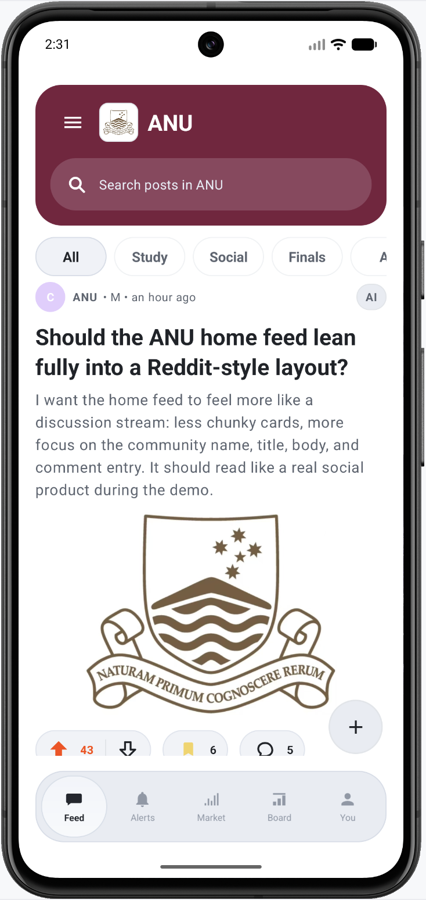
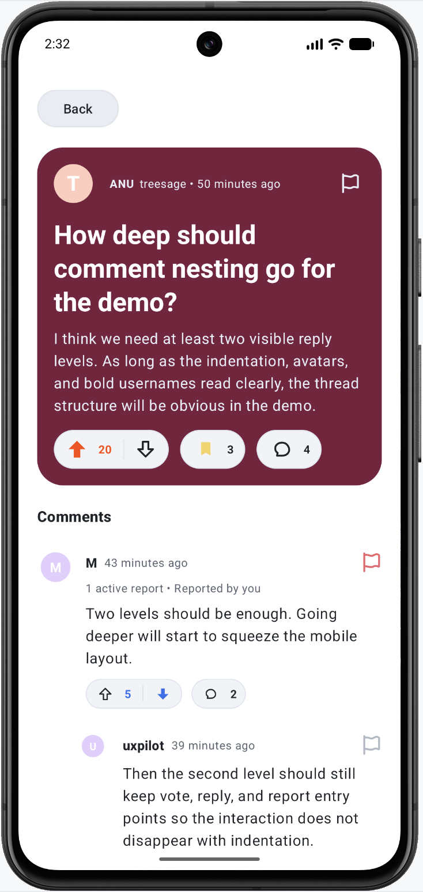
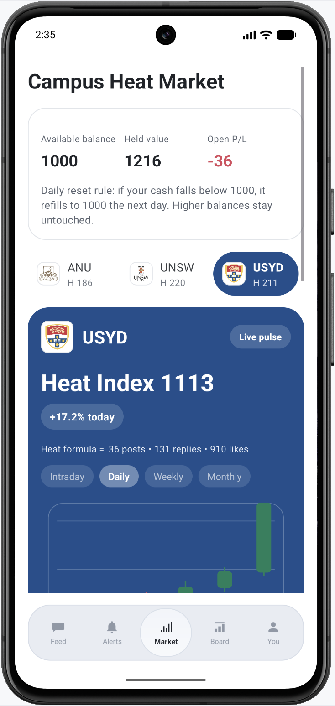
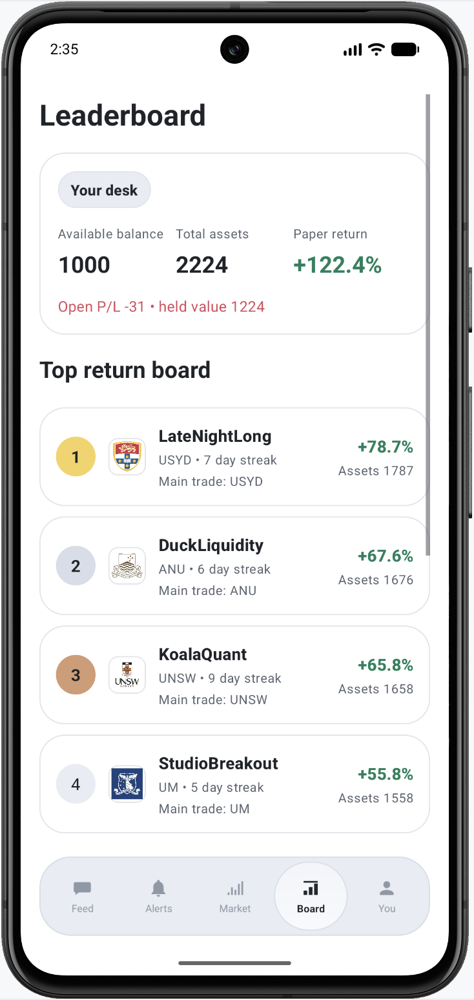

# De

De 是一个校园讨论社区 Android 应用 Demo，由 404 Sleep Not Found 团队开发。

它把校园论坛、审核机制和学校热度代币玩法结合在一起。用户可以在不同学校频道中浏览帖子、发布带图片的内容、查看多层评论；管理员可以处理举报内容；同时还可以参与基于社区活跃度生成的 Heat Market 和排行榜。

## 项目亮点

- 多学校频道切换，不同频道有不同视觉风格
- 支持发帖、图片上传和评论互动
- 评论区支持展开与折叠，移动端阅读更清晰
- 提供成员模式和管理员模式
- 管理员可在举报队列中快速查看和处理被举报内容
- 引入学校代币系统，热度由帖子、回复和点赞共同驱动
- 通过排行榜展示不同用户的市场表现
- 每日余额重置，保证玩法持续可体验

## 界面预览

| 首页信息流 | 评论区 |
| --- | --- |
|  |  |

| Heat Market | 排行榜 |
| --- | --- |
|  |  |

## Demo 体验流程

1. 使用 Demo 账号登录
2. 选择 Member 或 Admin
3. 浏览不同学校频道中的帖子
4. 在成员模式下举报评论
5. 在管理员模式下进入审核队列处理举报
6. 在 Heat Market 中交易学校代币并查看排行榜

## Demo 账号

用户名：1234

密码：1234

## 技术栈

- Java
- Android SDK
- Gradle
- 自定义审核模块与数据结构模块

## 项目结构

- android/：Android 应用代码与资源文件
- android/app/src/main/java/com/example/myapplication/：页面、组件与主要业务逻辑
- android/app/src/main/java/moderation/：举报、隐藏、审核队列相关逻辑
- app/src/：仓库中保留的原始课程侧 Java 模块
- picture/：README 展示用项目截图

## 运行方式

用 Android Studio 打开 android/

等待 Gradle 同步完成

在模拟器或真机上运行应用

也可以使用命令行构建：

```bash
cd android
./gradlew assembleDebug
```
